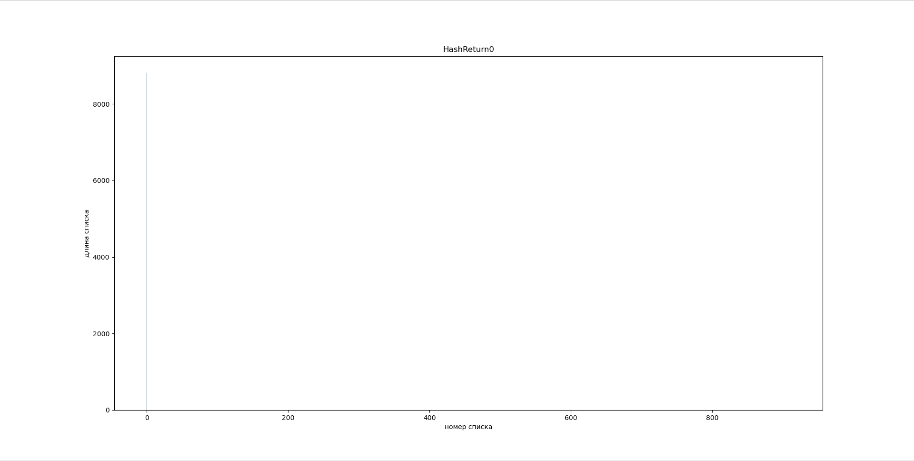
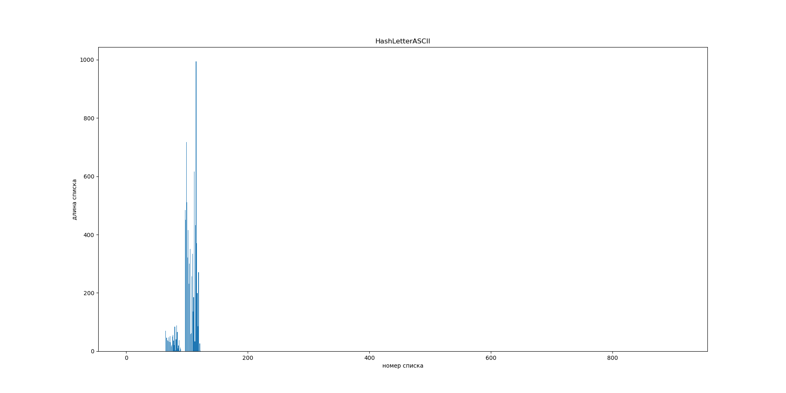
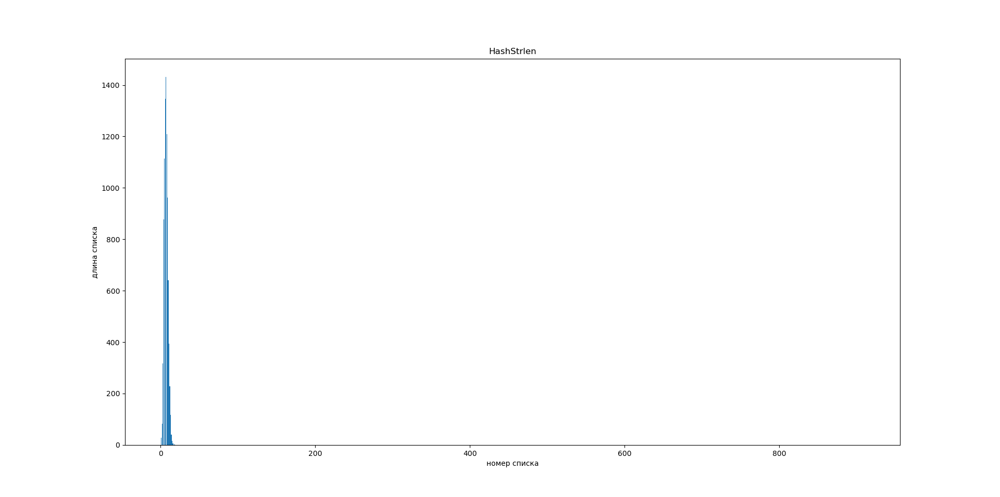
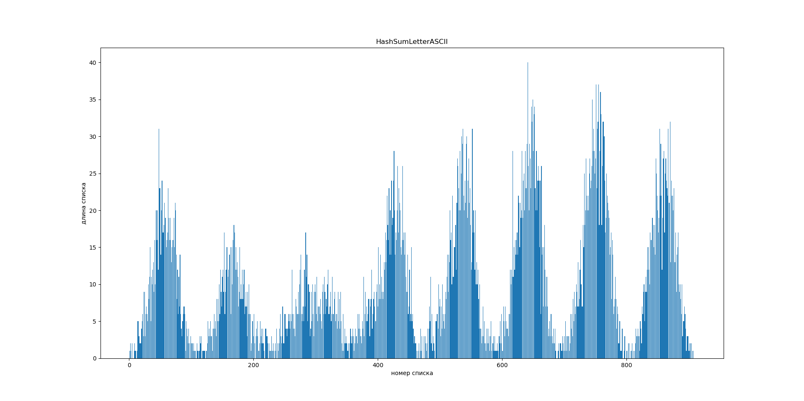
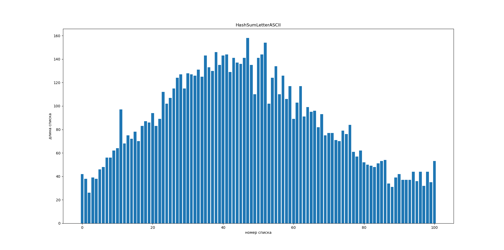
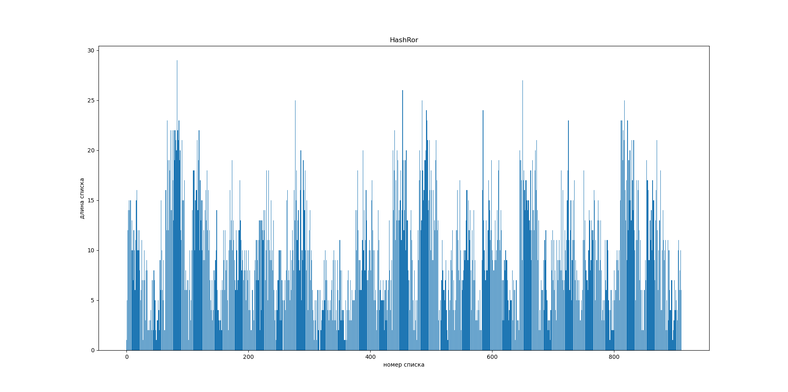
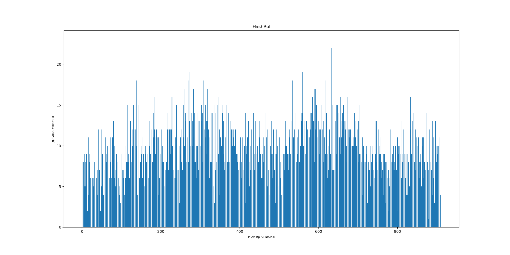
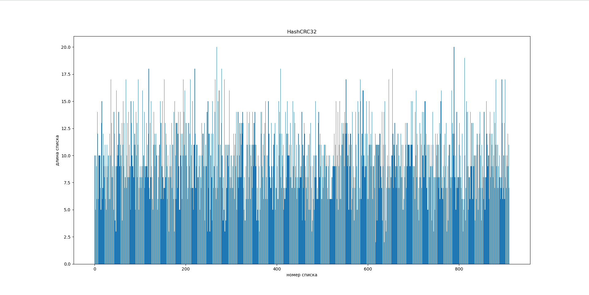
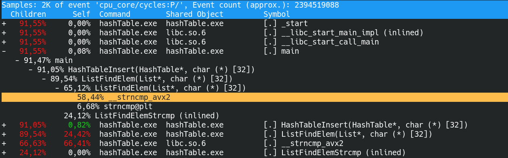
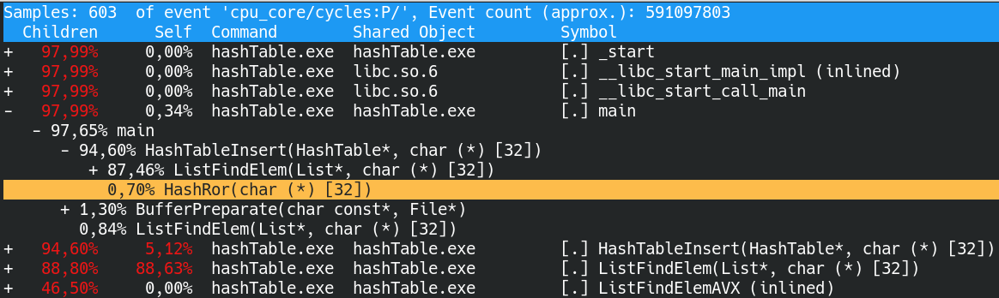

# HashTable и ее оптимизации с помощью ассемблера

В данной работе я реализовала структуру данных __хэш-таблицу__, выявила ее медленные места и оптимизировала их с помощью ассемблера.

## Хэш-функции
Я использовала 7 разных функция подсчета хэша:

### HashReturn0
```
Hash_t 
HashReturn0 (HashData_t* data)
{
    assert (data);
    assert (GetElemCharPtr (data));

    return 0;
}
```
### HashLetterASCII
```
Hash_t 
HashLetterASCII (HashData_t* data)
{
    assert (data);
    assert (GetElemCharPtr (data));

    return (Hash_t)GetElemCharPtr (data)[0];
}
```
### HashStrlen
```
Hash_t 
HashStrlen (HashData_t* data)
{
    assert (data);
    assert (GetElemCharPtr (data));

    Hash_t len = 0;
    while (GetElemCharPtr (data)[len] != 0) 
    {
        len++;
    }

    return len;
}
```
### HashSumLetterASCII
```
Hash_t 
HashSumLetterASCII (HashData_t* data)
{
    assert (data);
    assert (GetElemCharPtr (data));

    Hash_t sum = 0;
    for (size_t i = 0; GetElemCharPtr (data)[i] != 0; i++)
    {
        sum += (Hash_t)(GetElemCharPtr (data)[i]);
    }

    return sum;
}
```
### HashRor 
```
Hash_t 
HashRor (HashData_t* data)
{
    assert (data);
    assert (GetElemCharPtr (data));

    Hash_t hash = 0;
    
    for (size_t i = 0; GetElemCharPtr (data)[i] != 0; i++)
    {
        hash = ((hash >> 1) | (hash << (CHAR_BIT * sizeof(Hash_t) - 1))) 
                ^ (Hash_t)(GetElemCharPtr (data)[i]);
    }

    return hash;
}
```
### HashRol 
```
Hash_t 
HashRol (HashData_t* data)
{
    assert (data);
    assert (GetElemCharPtr (data));

    Hash_t hash = (Hash_t)GetElemCharPtr (data)[0];
    for (size_t i = 1; GetElemCharPtr (data)[i] != 0; i++)
    {
        hash = ((hash << 1) | (hash >> (CHAR_BIT * sizeof(Hash_t) - 1))) 
                ^ (Hash_t)(GetElemCharPtr (data)[i]);
    }

    return hash;
}
```
### HashCRC32
```
Hash_t 
HashCRC32 (HashData_t* data)
{
    assert (data);
    assert (GetElemCharPtr (data));

    unsigned int hash = 0xffffffff;
    for (int i = 0; GetElemCharPtr (data)[i] != 0; i++)
    {
        hash = (hash >> 8) ^ CRC32Table [(hash ^ (unsigned int)GetElemCharPtr (data)[i]) & 0xff];
    }

    return (Hash_t)~hash;
}
```

## Сравнение гистограмм распределния 

> Размер хэш-таблицы был подобран так, чтобы load factor был равен 10. Такое решение позволит лучше увидеть узкие места в программе.

Ниже приведены графики распределения значений хэш-функций:

### HashReturn0 


Дисперсия: 85125 \
Относительная дисперсия: 9458

### HashLetterASCII 


Дисперсия: 4139 \
Относительная дисперсия: 459

### HashStrlen 


Дисперсия: 9783 \
Относительная дисперсия: 1087

### HashSumLetterASCII 


Дисперсия: 71 \
Относительная дисперсия: 7



Дисперсия: 1371 \
Относительная дисперсия: 15

### HashRor 


Дисперсия: 29 \
Относительная дисперсия: 3

### HashRor 


Дисперсия: 12 \
Относительная дисперсия: 1

### HashCRC32 


Дисперсия: 10 \
Относительная дисперсия: 1

## Оптимизации

Хэш таблица работает медленее, чем хотелось бы, поэтому я решила ее оптимизировать.
> Замеры времени проводились с помощью функции __rdtsc ()

### Первая оптимизация -О3
Первой шагом стал флаг оптимизации -О3. С помощью него программу получилось ускорить на __168%__.


### Вторая оптимизация (AVX инструкции)
Далее с помощью perf я выявила самые медленные функции в программе.



Я оптимизировала функцию поиска элемента в списке ListFindElem () с помощью векторных инструкций AVX. Ниже представлен код функции до и после.

```
static Index_t
ListFindElemStrcmp (List* list, 
                    Data_t* data)
{
    assert (list);
    assert (data);

    for (size_t i = 0; i < list->size; i++)
    {
        if (strncmp (GetElemCharPtr (data), GetElemCharPtr(list->data[i]), hashTableKeySize) == 0)
	    {
            return (int)i;
	    }
    }

    return List::ELEM_NOT_FOUND;
}
```
```
static Index_t
ListFindElemAVX (List* list, 
                 Data_t* data)
{
    assert (list);
    assert (data);

    Vector_t value = GetElemAvx (data);
    Vector_t mAll1 = _mm256_set1_epi16 ((short)0xffff);
    
    for (size_t i = 0; i < list->size; i++)
    { 
        if (_mm256_testz_si256 (value - GetElemAvx (list->data[i]), mAll1) == 1)
        {
            return (int)i;
        }
    }

    return List::ELEM_NOT_FOUND;
}
```
Таким образом мне удалось ускорить программу на __411%__ относительно предыдущей версии.


### Третья оптимизация (ассемблер)
После я провела повторное профилирование программы. 

Теперь самая долгая функция подсчета хэша HashCRC32. Ее я решила оптимизировать с помощью ассемблерной функции crc32.
Теперь код выглядит так:
```
static Hash_t 
HashCRC32Simple (HashData_t* data)
{
    assert (data);
    assert (GetElemCharPtr (data));

    unsigned int hash = 0xffffffff;
    for (int i = 0; GetElemCharPtr (data)[i] != 0; i++)
    {
        hash = (hash >> 8) ^ CRC32Table [(hash ^ (unsigned int)GetElemCharPtr (data)[i]) & 0xff];
    }

    return (Hash_t)~hash;
}
```
```
static Hash_t 
HashCRC32AVX (HashData_t* data)
{
    assert (data);
    assert (GetElemCharPtr (data));

    return HashCRC32Asm (GetElemCharPtr (data));
}

//--------------------------//

section .text
HashCRC32Asm:
   
        mov     eax, -1

.for
        movzx   edx, BYTE [rdi]
        test    dl, dl
        je      .ret
        
        crc32   eax, dl

        add     rdi, 1
        jmp     .for

.ret:
        not     eax
        ret

```
Программа стала работать еще на __101%__ быстрее.


### Четвертая оптимизация (ассемблерная вставка)
После второго ускорения и повторного замера времени работы функции стало ясно, что последующие оптимизации не дадут большого прироста производительности. Однако передо мной стояла задача попробовать 3 вида ассемблерных оптимизация. 

Поэтому я ускорила функцию HashRor с помощью ассемблерной вставки. Код, который у меня получился:

```
static Hash_t 
HashRorSimple (HashData_t* data)
{
    assert (data);
    assert (GetElemCharPtr (data));

    Hash_t hash = 0;
    
    for (size_t i = 0; GetElemCharPtr (data)[i] != 0; i++)
    {
        hash = ((hash >> 1) | (hash << (CHAR_BIT * sizeof(Hash_t) - 1))) 
                ^ (Hash_t)(GetElemCharPtr (data)[i]);
    }

    return hash;
}
//---------------------------//
Godbolt edition:
        "mov     rdi, %1\n\t"
        "movsx   rdx, BYTE PTR [rdi]\n\t"
        "xor     eax, eax\n\t"
        "add     rdi, 1\n\t"
        "test    dl, dl\n\t"
        "je      .L12%=\n"
".L7%=:\n\t"
        "ror     rax\n\t"
        "add     rdi, 1\n\t"
        "xor     rax, rdx\n\t"
        "movsx   rdx, BYTE PTR -1[rdi]\n\t"
        "test    dl, dl\n\t"
        "jne     .L7%=\n\t"
        "ret\n"
".L12%=:\n\t"
        "ret\n\t"
```
```
static Hash_t 
HashRorInlineAsm (HashData_t* data)
{
    assert (data);
    assert (GetElemCharPtr (data));

    Hash_t hash = 0;

    __asm__ (
        ".intel_syntax noprefix\n\n\t"

        "mov     rdi, %1\n\t"
        "xor     rax, rax\n"

".for%=:\n\t"        
        "movsx   rdx, BYTE PTR [rdi]\n\t"
        "test    dl, dl\n\t"
        "je      .ret%=\n\n\t"

        "ror     rax\n\t"
        "xor     rax, rdx\n\t"
        "add     rdi, 1\n\t"
        "jmp     .for%=\n"
".ret%=:\n\t"
        "mov     %0, rax\n\t"

        ".att_syntax\n"

        :"=r"(hash)             
        :"r"(GetElemCharPtr (data))               
        :"%rax", "%rdi", "%rdx"
    );

    return hash;
}
```

## Итого:

| Оптимизация | Время работы программы | Ускорение относительно предыдущей версии | Ускорение относительно О0 | Ускорение относительно О3 |
|:-----------:|:--------:|:---------:|:---------:|:---------:|
| O0                                      | 2599 * 10^6 | -      | -    | -    |
| O3                                      | 1550 * 10^6 | 168%   | 168% | -    |
| O3 + ListFindElem                       | 377 * 10^6  | 411%   | 689% | 411% |
| O3 + ListFindElem + HashCRC32           | 374 * 10^6  | 101%   | 695% | 414% |
| O3 + ListFindElem + HashCRC32 + HashRor | 372 * 10^6  | 100,4% | 698% | 416% |

Мне удалось ускорить хэш-таблицу в 4 раза! \
Но для этого мне пришлось написать 20 ассемблерных команд, что ухудшает универсальность программы. __Общее КПД__ = $\frac{4,16}{20} * 1000 = 208$

## Благодарности

1) [Денис Дедков](https://github.com/d3phys)
2) [Илья Дединский](https://github.com/ded32)
